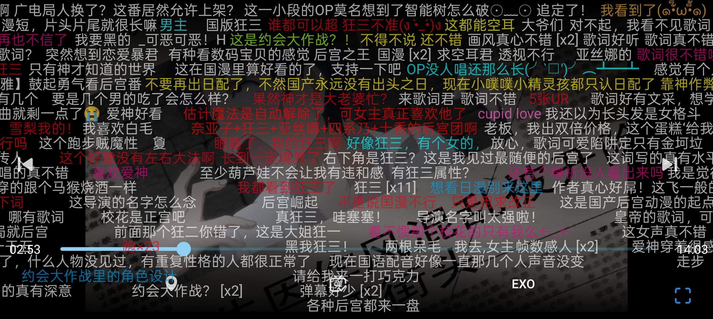

# Nefyra

Nefyra 是一个使用 Lua 开发的轻量级番剧观看应用程序，支持高级网页内容采集和动态解析。

## 支持平台
- Android 6 及以上

## 功能特性
- 支持 XPath 语法规则进行网页内容采集
- 已支持获取动态加载的 HTML 内容
- 自动解析视频资源（功能正在测试中）
- 双弹幕源：bilibili 与 dandanplay
- 垃圾弹幕处理功能（暂不支持编辑）

## 屏幕截图
<table>
  <tr>
    <td></td>
    <td></td>
    <td></td>
  </tr>
</table>
